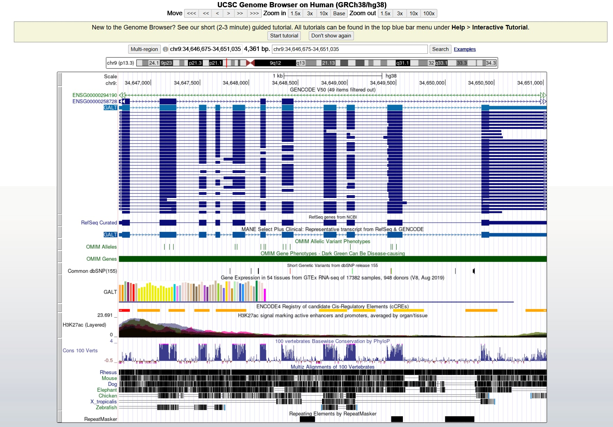
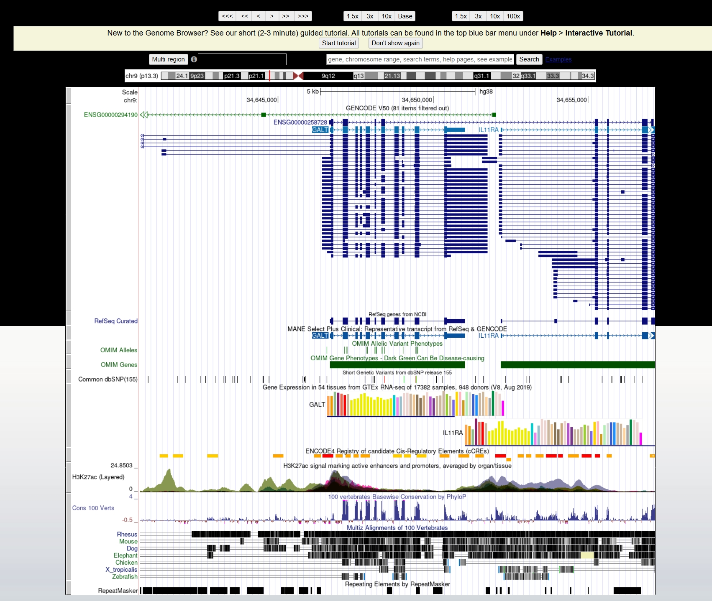
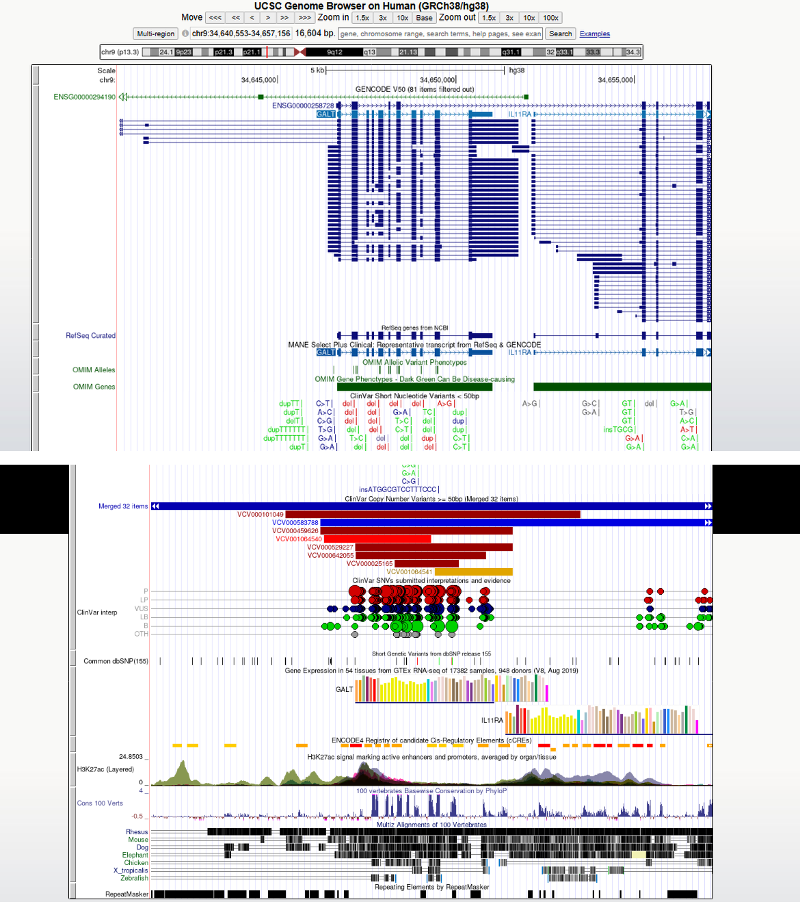
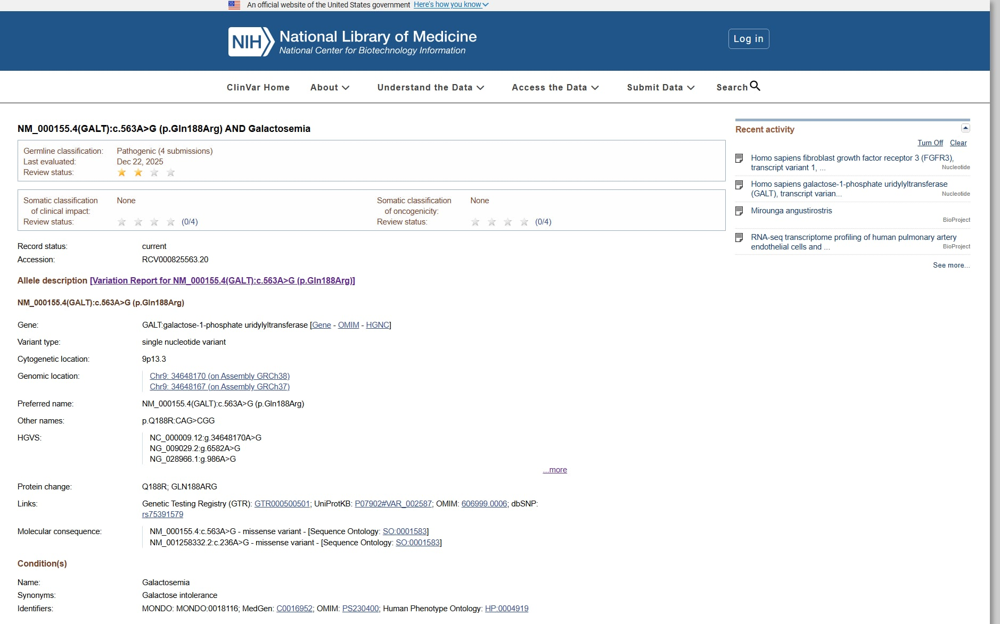
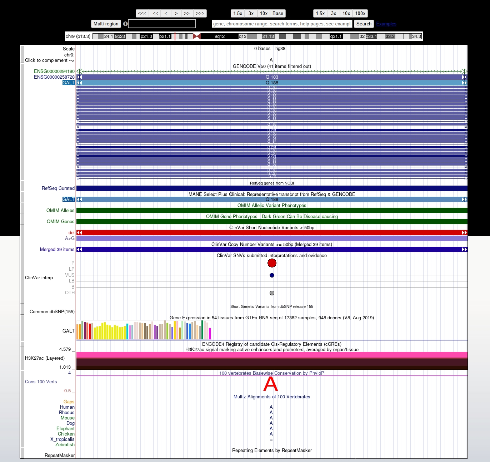

# Exploring a Human Disease Gene Using UCSC Genome Browser and NCBI ClinVar

**Name:** Shahanta Dawn B. Balanza  
**Previously Assigned Gene:** GALT  
**Associated Disease:** Classic Galactosemia  
**Date:** September 23, 2026

## Activity Purpose

This activity investigates the human **GALT** gene using the **UCSC Genome Browser** and **NCBI ClinVar**. The activity focuses on locating the GALT gene in the human genome, examining its exon-intron structure and transcripts, exploring genome annotation and clinical variant tracks, and investigating a clinically reported GALT variant.

## 1. Assigned Gene and Disease

## 2. UCSC Gene Location

The **GALT** gene was located using the **UCSC Genome Browser** with the human **GRCh38/hg38** assembly. The gene is located on **chromosome 9 (chr9)** at genomic coordinates **chr9:34,646,675–34,651,035**. The GALT gene is approximately **4,361 bp (4.36 kb)** in genomic length and is located on the **positive (+) DNA strand**.

| **Gene Location Information** | **Details** |
|---|---|
| **Official gene symbol** | **GALT** |
| **Full gene name** | **galactose-1-phosphate uridylyltransferase** |
| **Chromosome** | **9 (chr9)** |
| **Genome assembly** | **GRCh38/hg38** |
| **Genomic coordinates** | **chr9:34,646,675–34,651,035** |
| **DNA strand** | **Positive (+) strand** |
| **Approximate gene size** | **4,361 bp (~4.36 kb)** |

**Figure 1.** UCSC Genome Browser showing the genomic location of the human **GALT** gene on chromosome 9.

## 3. Exons, Introns, and Transcripts

### a. Number of Exons

**11 exons** are identified in the selected **NM_000155.4 (GALT)** transcript.

### b. Multiple Transcripts/Isoforms

**Yes.** Multiple transcripts/isoforms of the **GALT** gene are visible in the UCSC Genome Browser.

### c. Difference Between an Exon and an Intron

An **exon** is a part of a gene that remains in the mature RNA after splicing, while an **intron** is an intervening part of the gene that is removed during RNA splicing.

### d. Intron vs. Exon Length

The **introns generally appear longer than the exons** in the **GALT** gene, as the regions connecting the exon blocks are generally more extensive than the exon regions themselves.

**Figure 2.** UCSC Genome Browser showing the exon-intron structure and transcript models of the human **GALT** gene.

## 4. UCSC Annotation Tracks

### a. Which gene annotation track did you use?

The **GENCODE V50** and **NCBI RefSeq** tracks were used to view the gene and transcript annotations of the **GALT** gene.

### b. Were ClinVar-related variant marks visible within or near your gene?

**Yes.** Multiple ClinVar-related variant marks are visible within and near the **GALT** gene region.

### c. Were some regions more conserved than others?

**Yes.** The conservation track shows that some regions of the **GALT** gene are more strongly conserved than others.

### d. Did conserved regions correspond mainly to exons, introns, both, or another region?

The stronger conserved regions appear mainly around **exonic and coding regions**, although some conservation is also visible in non-coding regions.

### e. Why can strong conservation suggest biological importance?

Strong conservation suggests that a DNA region may have an important biological function because it has remained similar across different species. Regions that are important for normal gene or protein function are more likely to be preserved through evolution.

**Figure 3.** GALT gene with ClinVar and conservation tracks in UCSC Genome Browser.

## 5. Selected ClinVar Variant

The selected ClinVar variant is the **GALT c.563A>G (p.Gln188Arg)** variant, also known as **Q188R**, associated with galactosemia.

| Variant Information | Result |
|---|---|
| Gene | **GALT** |
| HGVS notation | **NM_000155.4(GALT):c.563A>G (p.Gln188Arg)** |
| rsID | **rs75391579** |
| ClinVar Variation ID | **3614** |
| Chromosome | **Chromosome 9** |
| Genomic position | **Chr9:34648170 (GRCh38)** |
| Condition | **Galactosemia** |
| Clinical significance | **Pathogenic** |
| Review status | **Criteria provided, multiple submitters, no conflicts** |
| ClinVar accession | **RCV000825563.20** |

**Figure 4.** ClinVar record for the **GALT c.563A>G (p.Gln188Arg)** variant associated with galactosemia.

**ClinVar:** https://www.ncbi.nlm.nih.gov/clinvar/RCV000825563/

## 6. Locating the Variant in UCSC

The selected ClinVar variant **NM_000155.4(GALT):c.563A>G (p.Gln188Arg)** was located in the UCSC Genome Browser using the GRCh38 genomic coordinate **chr9:34648170**.

### a. Where is the variant located relative to your gene?

The variant is located **within the GALT gene** at **chr9:34648170 (GRCh38)**.

### b. Is it in an exon, intron, UTR, splice region, or another region?

The variant is located in an **exon** of the GALT gene. ClinVar identifies the variant as occurring in **exon 6**.

### c. Is it likely in a coding or non-coding region?

The variant is likely in a **coding region**. The UCSC view shows **Q188** in the GALT protein annotation, consistent with the variant affecting amino acid 188.

### d. Based on its location and ClinVar information, how might the variant affect the gene or gene product?

The variant changes **c.563A>G**, resulting in the amino-acid substitution **p.Gln188Arg (Q188R)**. Because it changes an amino acid in the GALT protein and is classified as **pathogenic for galactosemia in ClinVar**, it may alter GALT protein function.

### e. What additional evidence would be needed before concluding that the variant causes disease?

Additional evidence could include **functional studies showing reduced GALT enzyme activity, observations in affected individuals, genetic segregation data, and population-frequency data**. These types of evidence help establish whether the variant has a disease-causing effect rather than relying only on its genomic location.

**Figure 5.** GALT gene model showing the selected ClinVar variant in UCSC Genome Browser.

## 7. Interpretation

## 8. Reflection

## 9. References and Links
